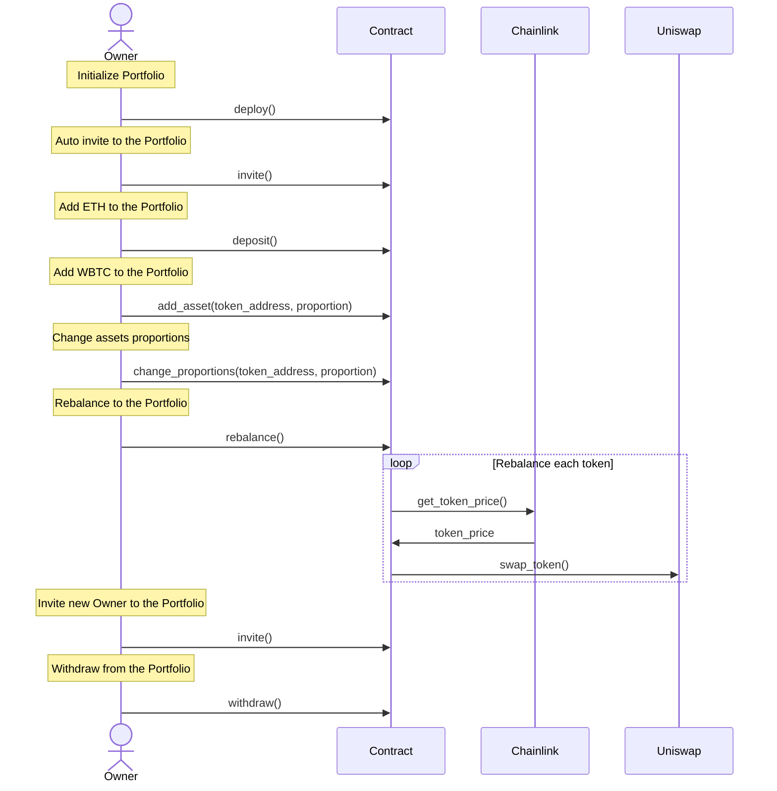
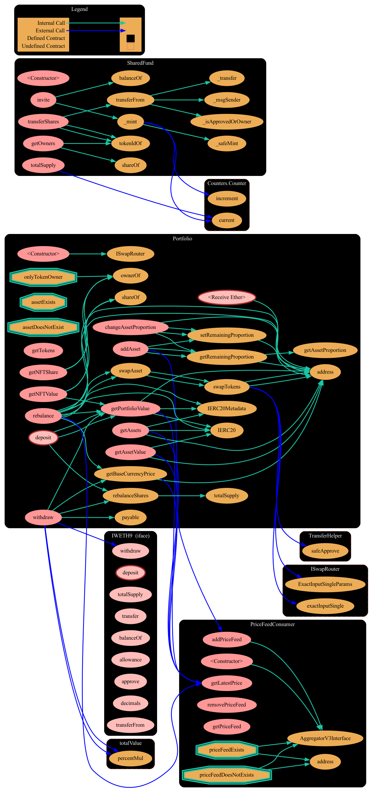

# Shared Fund

Create or join a crypto investment portfolio with constant proportions that is balancing when the market moves.

Your share in a Portfolio is represented as a NFT that can be transfer. You can claim your share back at any moment.

The Portfolio is rebalanced using Chainlink to determine the moment and Uniswap to execute the swap.

## Specification



## Design

### Smart Contrcat



## Stack

- Foundry / Anvil
- WAGMI (React)
- Chainlink
- Uniswap
- OpenZeppelin
- Solidity

## Quickstart

It is necessary to have installed [Foundry](https://book.getfoundry.sh/getting-started/installation) to be able to build, test and deploy the project. After setting up foundry, use the following commands to setup, test and deploy the project:

```sh
make # setup the project
forge test # run the tests locally
make anvil-fork-mainnet # start a mainnet fork
# modify the .env file to add:
# - the private key (found the last output of previous command)
# - the mainnet rpc url (you can get one in alchemy.com)
make deploy-anvil # deploy the contract to the mainnet fork
cd app && yarn && yarn dev # start the app
# import the private key from anvil to your wallet
# open the app in http://localhost:3000
# connect your wallet and start using the app
# change the network of your wallet to localhost:8545
# change the chainId of the localnet on metamask to 1
# copy your public address and invite yourself
# using the "Invite New Owner" button in "/fund" 
```
