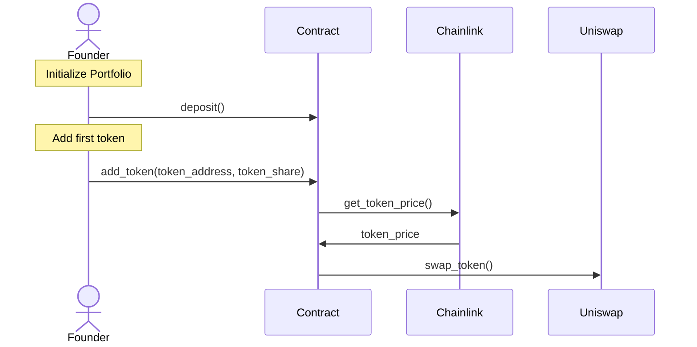

# Shared Fund

Create or join a crypto investment portfolio with constant proportions that is balancing when the market moves.

Your share in a Portfolio is represented as a NFT that can be transfer. You can claim your share back at any moment.

The Portfolio is rebalanced using Chainlink to determine the moment and Uniswap to execute the swap.



## Stack

- Foundry
- WAGMI (React)
- Chainlink
- Uniswap
- Solidity

## APIs

The following are the methods available in the contract. All the method pointed with majority emit events.

```solidity
invite(address) //  only majority shareholders

deposit() // only shareholders

getTokenPrice() 

rebalance() // only majority shareholders

update_repartition() // only majority shareholders

add_token()

add_token_auto_rebalance()

remove_token()

remove_token_auto_rebalance()

copy()

sell_share()

withdraw()
```
